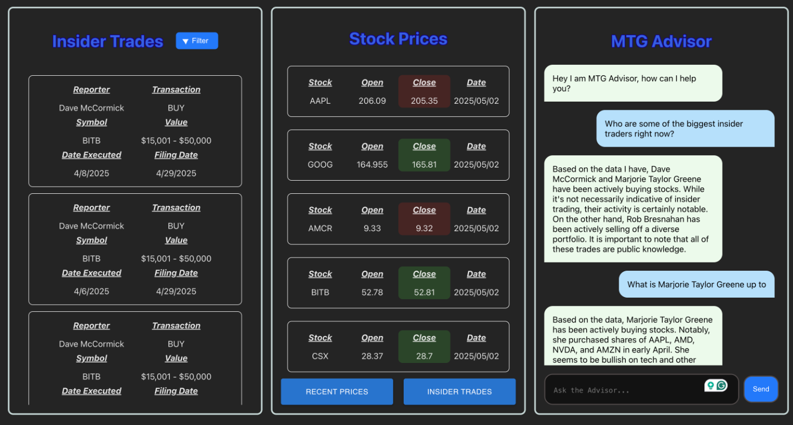

# 📈 MTG Advisor – AI-Powered Insider Trade Insights

## 💡 Inspiration

With the economy in crisis, rising tariffs, and increased volatility in the stock market, I wanted to find a smarter way to understand and predict market behavior. The solution? Look at the insiders. **MTG Advisor** was built to analyze financial activity from U.S. senators and translate that information into meaningful investment insights. The goal: better decisions during uncertain times.

## 🚀 What It Does

**MTG Advisor** is an AI-powered tool that analyzes the latest insider trades filed by U.S. senators. By comparing live and historical stock data, the app identifies patterns and offers predictions on potential stock movements. Beyond that, it acts as a general financial advisor—offering tailored suggestions on how to invest based on current market data.

## 🛠️ How I Built It

* **Frontend:** Built with React using Vite for rapid development and a fast setup
* **Backend:** Powered by Flask to manage API calls and data orchestration
* **Data Sources:** Utilizes three APIs to fetch, compare, and analyze insider trade and stock data in real time

## 🧩 Challenges I Faced

* **Git Collaboration:** This project highlighted the steep learning curve around proper Git workflows, especially while collaborating
* **Backend Complexity:** Integrating and synchronizing data from multiple APIs required deep documentation work and debugging
* **React & CSS:** As my first large-scale React project, I learned a lot about component structure, state management, and styling

## ✅ Accomplishments

* Delivered a functioning and polished full-stack application
* Integrated live data from multiple sources and built meaningful visualizations
* Successfully distributed and integrated core features across the app

## 📚 What I Learned

* React development and UI/UX design principles
* Flask API development and data handling
* Importance of planning, sketching wireframes, and collaborative problem-solving

## 🔮 What’s Next

Planned future improvements:

* Enhance UI design for a smoother user experience
* Expand the AI's analysis capabilities
* Integrate a broader dataset for more accurate predictions

## 🖼️ Screenshots

  

---

## 📬 Contact

* GitHub: [@SecretariatV](https://github.com/SecretariatV)
* Email: [oliver.b25.f@gmail.com](mailto:oliver.b25.f@gmail.com)
* Telegram: [@ares\_orb](https://t.me/ares_orb)
